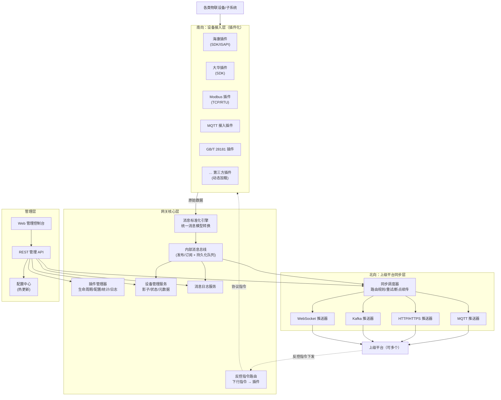
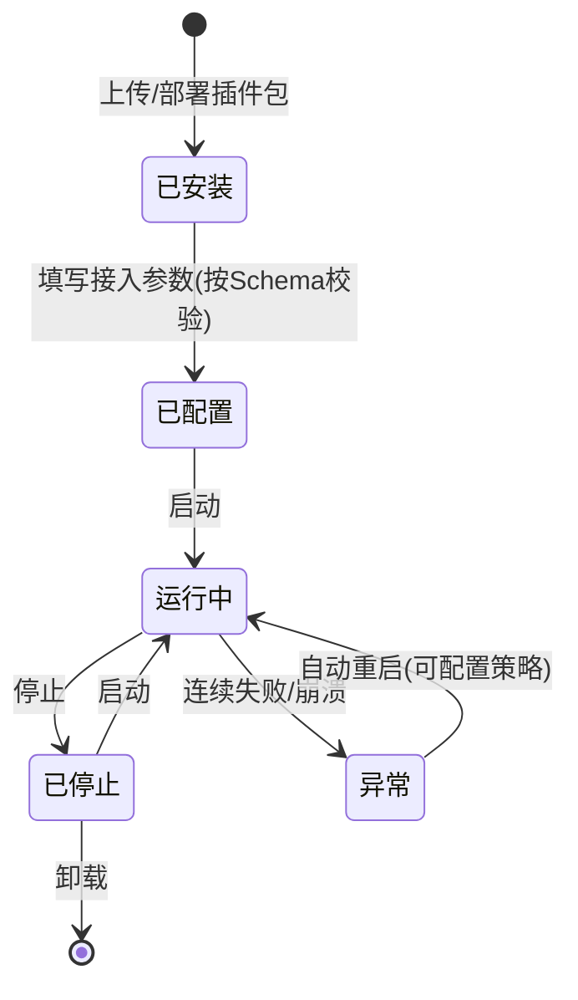
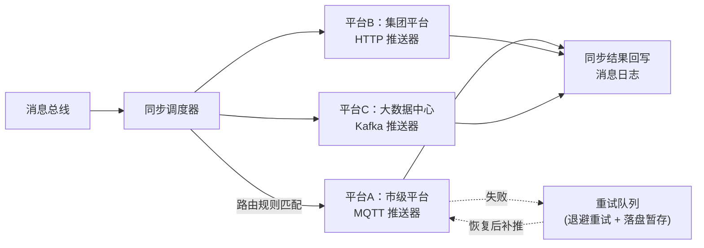
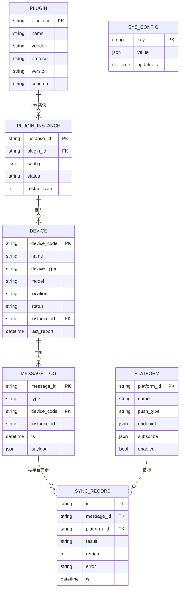

# 物联网网关（IoT Gateway）原型设计

> 本文档为原型设计说明，配套静态页面原型位于 `prototype/` 目录（浏览器直接打开 `prototype/index.html` 即可查看，无需任何构建环境）。本设计不包含代码实现。

---

## 1. 设计目标与需求映射

| # | 需求 | 对应设计章节 | 对应原型页面 |
|---|------|-------------|-------------|
| 1 | 多厂商/多协议的告警、监测、设备、设备反控统一接入 | §3 插件化接入框架、§4 统一消息模型 | 插件管理 `plugins.html` |
| 2 | 统一消息格式同步上级平台，平台地址/推送方式可动态配置 | §5 上级平台同步（北向） | 系统配置-上级平台 `settings.html` |
| 3 | 厂商抽象为插件，动态配置参数、动态启停、消息统计、运行日志 | §3 插件化接入框架 | 插件管理 `plugins.html` |
| 4 | 设备管理（状态/编码/位置/类型/型号），删除、修改、指定同步 | §6 设备管理 | 设备管理 `devices.html` |
| 5 | 接入消息日志（类型、是否成功同步） | §7 消息日志 | 消息日志 `messages.html` |
| 6 | 系统配置（IP、核心参数、上级平台） | §8 系统配置 | 系统配置 `settings.html` |
| 7 | 首页概览 | §9 首页概览 | 首页 `index.html` |

---

## 2. 总体架构

### 2.1 架构分层



### 2.2 核心设计原则

1. **南北向解耦**：南向插件只负责「协议 → 统一消息」的转换与「统一指令 → 协议」的反向转换；北向推送器只消费统一消息。两侧通过内部消息总线通信，互不感知。
2. **一切皆插件**：南向厂商接入是插件，北向推送方式（MQTT/HTTP/Kafka/WebSocket…）同样以适配器形式可扩展，新增推送方式无需改动核心。
3. **配置驱动 + 热更新**：插件参数、平台地址、推送方式均存于配置中心，修改后动态生效（插件重载、推送器重建连接），无需重启网关。
4. **消息不丢**：总线带持久化队列，上级平台不可达时消息落盘暂存，恢复后按序补推（断点续传），并在消息日志中记录每一次同步结果。

---

## 3. 插件化接入框架（南向）

### 3.1 插件抽象

每个厂商/协议接入被抽象为一个 **接入插件（Access Plugin）**，插件包 = 描述文件 + 可执行模块 + 参数 Schema：

```
plugin-hikvision-1.2.0/
├── plugin.yaml          # 插件描述：ID、名称、厂商、协议、版本、能力声明
├── config-schema.json   # 参数 Schema：驱动管理页「动态配置表单」的渲染
└── module/              # 插件实现（jar / so / 独立进程，按运行时而定）
```

**plugin.yaml 描述示例（示意）：**

```yaml
id: hikvision-isapi
name: 海康威视接入插件
vendor: Hikvision
protocol: ISAPI/SDK
version: 1.2.0
capabilities: [alarm, telemetry, device_info, control]   # 能力声明
configSchema: config-schema.json
```

`config-schema.json` 声明该插件需要哪些接入参数（如服务器 IP、端口、账号、密码、订阅通道等），管理页面据此**动态渲染配置表单**——这是「动态配置接入参数」的关键：新插件无需改前端。

### 3.2 插件生命周期与状态机



- **动态启停**：启动/停止仅影响单个插件实例，不影响网关其他部分。
- **故障隔离**：插件运行在独立线程池/独立进程中，单插件崩溃不拖垮网关；支持「异常自动重启」策略（重启次数、退避间隔可配）。
- **多实例**：同一插件可创建多个实例（如对接两套海康平台），每个实例独立配置、独立启停、独立统计。

### 3.3 插件必须实现的统一接口（SPI，示意）

| 接口方法 | 方向 | 说明 |
|---------|------|------|
| `init(config)` | — | 按接入参数初始化 |
| `start()` / `stop()` | — | 启停接入 |
| `healthCheck()` | — | 健康探测（供状态展示与自动重启判断） |
| `onDeviceDiscovered(cb)` | 上行 | 设备发现/上下线 → 统一设备消息 |
| `onTelemetry(cb)` | 上行 | 监测数据 → 统一监测消息 |
| `onAlarm(cb)` | 上行 | 告警事件 → 统一告警消息 |
| `execCommand(cmd)` | 下行 | 接收统一反控指令，转换为厂商协议执行，返回回执 |

### 3.4 插件运行统计与日志

每个插件实例由插件管理器统一采集：

- **消息统计**：累计/今日接入消息数，按消息类型（告警/监测/设备事件/指令回执）细分；转换失败数；最近 24h 曲线。
- **运行日志**：插件框架为每个实例分配独立日志通道（`logs/plugins/<instanceId>/`），级别可动态调整（DEBUG/INFO/WARN/ERROR），按大小+天数滚动清理；管理页面支持在线查看、按级别过滤、下载。
- **健康指标**：连接状态、最近心跳时间、异常重启次数。

---

## 4. 统一消息模型

所有南向数据进入总线前，由标准化引擎转换为统一消息格式（Envelope + Payload）：

```json
{
  "messageId": "uuid",
  "messageType": "ALARM | TELEMETRY | DEVICE_EVENT | COMMAND | COMMAND_ACK",
  "timestamp": 1752562800000,
  "gatewayId": "GW-0001",
  "source": { "pluginId": "hikvision-isapi", "instanceId": "hik-01" },
  "device": { "deviceCode": "DEV-CAM-0012", "deviceType": "camera", "model": "DS-2CD3T46" },
  "payload": { }
}
```

**payload 按 messageType 定义（示例）：**

| 类型 | 关键字段 |
|------|---------|
| `ALARM` 告警 | `alarmType`、`level`(1~4)、`description`、`picture/videoUrl`、`raw`(原始报文，可选携带) |
| `TELEMETRY` 监测 | `metrics: {温度: 23.5, 湿度: 40, ...}`（键值对，支持自定义指标） |
| `DEVICE_EVENT` 设备事件 | `event`: online / offline / registered / updated / deleted |
| `COMMAND` 反控指令 | `command`、`params`、`issuer`(下发方：上级平台/本地)、`ttl` |
| `COMMAND_ACK` 指令回执 | `commandId`、`result`: success / fail / timeout、`detail` |

> 反控链路：上级平台/本地页面下发 `COMMAND` → 指令路由按 `deviceCode` 找到归属插件实例 → 插件转厂商协议执行 → 产生 `COMMAND_ACK` 回执，同步回上级平台并记入消息日志。

---

## 5. 上级平台同步（北向）

### 5.1 动态可扩展的推送架构



- **平台可多个**：支持同时对接 N 个上级平台，每个平台独立配置、独立启停。
- **推送方式动态可配**：每个平台可选择推送方式（MQTT / HTTP(S) / Kafka / WebSocket，可扩展），选择后表单动态展示该方式的参数（地址、Topic/URL、认证、QoS 等）。
- **动态生效**：新增/修改平台配置后热加载，推送器自动重建连接，无需重启。
- **路由规则**：每个平台可配置订阅范围——消息类型（告警/监测/设备事件/回执）、设备范围（全部/指定类型/指定设备），实现「不同平台推不同的数据」。
- **可靠性**：推送失败进入重试队列（指数退避，次数可配），超限落盘为「待补推」；每条消息对每个目标平台的同步结果（成功/失败/重试中/待同步）都记入消息日志，支持手工「重推」。

### 5.2 平台配置数据结构（示意）

```json
{
  "platformId": "PF-001",
  "name": "市级物联平台",
  "enabled": true,
  "pushType": "MQTT",
  "endpoint": { "broker": "tcp://10.1.1.10:1883", "topic": "gw/{gatewayId}/up", "qos": 1,
                 "username": "gw01", "password": "******" },
  "subscribe": { "messageTypes": ["ALARM", "TELEMETRY", "DEVICE_EVENT"], "deviceScope": "ALL" },
  "retry": { "maxRetries": 5, "backoffSeconds": [2, 4, 8, 16, 32] }
}
```

---

## 6. 设备管理

### 6.1 设备模型

| 字段 | 说明 |
|------|------|
| deviceCode | 设备编码（网关内唯一，支持自定义编码规则） |
| name | 设备名称 |
| deviceType | 类型（摄像机/门禁/传感器/水浸/烟感…，可扩展字典） |
| model | 型号 |
| vendor / pluginInstance | 所属厂商 / 归属插件实例 |
| location | 位置（文本 + 可选经纬度） |
| status | 状态：在线 / 离线 / 故障 / 未激活 |
| lastReportTime | 最后上报时间 |
| syncStatus | 上级平台同步状态（已同步/未同步/同步失败，按平台细分） |
| extAttrs | 扩展属性（JSON，厂商私有字段） |

### 6.2 功能设计

- **自动注册 + 手工维护**：插件发现的设备自动登记；页面支持修改（名称、位置、类型、型号、编码等）与删除（删除时联动通知插件取消订阅，并向上级平台发 `DEVICE_EVENT: deleted`）。
- **指定设备同步**：支持单个/批量勾选设备 →「同步至上级平台」→ 选择目标平台 → 生成 `DEVICE_EVENT` 消息推送，并回写各平台的同步状态。
- **筛选检索**：按关键字（编码/名称）、类型、归属插件、状态、同步状态组合筛选。

---

## 7. 接入消息日志

- 记录每条经过总线的统一消息：消息ID、时间、类型、设备编码、来源插件、消息摘要。
- **同步结果按平台展开**：一条消息 × N 个目标平台 = N 条同步记录（成功/失败/重试中/待同步 + 失败原因 + 耗时）。
- 支持筛选（时间范围、类型、插件、设备、同步状态）、查看详情（**原始报文与统一格式对照**）、失败**手工重推**、导出。
- 存储策略：本地库滚动存储，保留天数/容量上限在「系统核心参数」中配置，超限自动清理。

---

## 8. 系统配置

分三个页签：

1. **网络/IP 配置**：网卡列表；每张网卡支持 DHCP/静态 IP，配置 IP、子网掩码、网关、DNS；修改需二次确认（防止失联），应用后展示新地址提示。
2. **系统核心参数**：网关标识（gatewayId、名称）、消息队列容量与落盘上限、日志保留天数、设备离线判定阈值、NTP 时间同步、管理端口、告警联动开关、插件异常自动重启策略等。
3. **上级平台配置**：平台列表（名称、推送方式、地址、订阅范围、连接状态、启用开关），支持新增/编辑/删除/连接测试；编辑表单按推送方式**动态切换参数区**。

---

## 9. 首页概览

一屏呈现网关运行全貌：

- **顶部指标卡**：设备总数与在线率、今日接入消息数、今日告警数（未处理数）、插件运行状态（运行中/总数）、上级平台同步成功率。
- **24h 消息趋势图**（按小时）与**消息类型分布**。
- **插件状态列表**（状态、今日消息数、快捷启停入口）。
- **上级平台连接状态**（每个平台的连接/积压情况）。
- **最新告警滚动列表**。
- **系统资源**：CPU / 内存 / 磁盘 / 网络（网关多为边缘盒子，资源监控必要）。

---

## 10. 数据模型（核心表）



---

## 11. 管理 API 设计（REST，节选）

| 方法 | 路径 | 说明 |
|------|------|------|
| GET | `/api/overview` | 首页概览聚合数据 |
| GET/POST | `/api/plugins`、`/api/plugins/{id}/instances` | 插件与实例管理 |
| POST | `/api/plugin-instances/{id}/start` / `/stop` | 动态启停 |
| PUT | `/api/plugin-instances/{id}/config` | 动态更新接入参数（热生效） |
| GET | `/api/plugin-instances/{id}/stats` / `/logs` | 消息统计 / 运行日志 |
| GET/PUT/DELETE | `/api/devices`、`/api/devices/{code}` | 设备查询/修改/删除 |
| POST | `/api/devices/sync` | 指定设备同步至上级平台（body: deviceCodes[], platformIds[]） |
| GET | `/api/messages`、`/api/messages/{id}` | 消息日志检索/详情 |
| POST | `/api/messages/{id}/repush` | 失败消息重推 |
| GET/POST/PUT/DELETE | `/api/platforms` | 上级平台增删改查、`/test` 连接测试 |
| GET/PUT | `/api/system/network`、`/api/system/params` | IP 配置 / 核心参数 |

---

## 12. 技术选型建议（供实现阶段参考）

| 维度 | 建议 | 理由 |
|------|------|------|
| 运行形态 | 边缘侧单体 + 内嵌 Web | 网关通常部署在边缘盒子/工控机 |
| 后端 | Java (Spring Boot + PF4J 插件框架) 或 Go (HashiCorp go-plugin) | 均有成熟插件化方案；Java 生态下厂商 SDK 更全 |
| 内部总线 | 内嵌持久化队列（如 disruptor + 本地落盘 / embedded MQ） | 断网不丢消息 |
| 存储 | SQLite / H2（边缘）；可选对接外部 MySQL | 轻量免运维 |
| 前端 | Vue3 + Element Plus 或 React + Antd | 动态表单（JSON Schema 渲染）生态成熟 |

---

## 13. 页面原型清单

| 页面 | 文件 | 覆盖需求 |
|------|------|---------|
| 首页概览 | `prototype/index.html` | 需求 7 |
| 设备管理 | `prototype/devices.html` | 需求 4 |
| 插件管理（含配置/日志/统计） | `prototype/plugins.html` | 需求 1、3 |
| 接入消息日志 | `prototype/messages.html` | 需求 5 |
| 系统配置（IP/核心参数/上级平台） | `prototype/settings.html` | 需求 2、6 |

原型为纯静态 HTML/CSS（少量 JS 用于页签/弹窗交互演示），双击即可在浏览器中查看。
